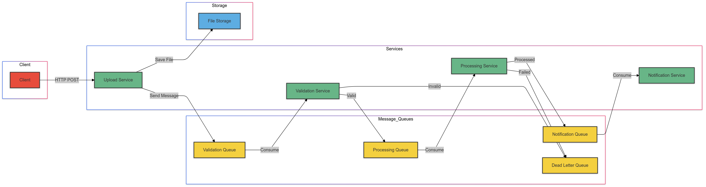

# File Processing Pipeline

A distributed system for processing image files using microservices and message queues.

# Architecture overview


## Technologies Used

### Languages and Frameworks
- **Python 3.9**
- **Flask**: Web framework for upload service
- **Pillow (PIL)**: Image processing library

### Message Queue
- **RabbitMQ 3**: Message broker for service communication
- **Pika**: Python RabbitMQ client

### Containerization
- **Docker**: Container platform
- **Docker Compose**: Multi-container orchestration

### Image Processing Features
- Image resizing (max 800x800)
- Format support: PNG, JPG, JPEG, GIF
- Aspect ratio preservation

### Service Communication
- REST API (Upload Service)
- Asynchronous messaging (Inter-service)
- Dead Letter Queue for error handling

## Dependencies

Service-specific dependencies are listed in their respective requirements.txt files:

## Configuration

Key configuration parameters (in shared/config.py):
- Max file size: 10MB
- Supported formats: PNG, JPG, JPEG, GIF
- Image max dimensions: 800x800 pixels
- RabbitMQ connection details
- Queue names and configurations

## Architecture Overview

The system consists of four microservices:
- **Upload Service**: Receives files via HTTP and initiates processing
- **Validation Service**: Validates file format, size, and type
- **Processing Service**: Processes images (resizing)
- **Notification Service**: Handles completion notifications

## Prerequisites

- Docker and Docker Compose
- cURL (for testing)
- At least 4GB RAM
- 10GB free disk space

## Setup and Installation

1. Clone the repository:
```bash
git clone <repository-url>
cd simple-file-processing-pipeline
```

2. Create necessary directories:
```bash
mkdir -p uploads
```

3. Build and start services:
```bash
docker-compose build
docker-compose up -d
```

4. Verify services are running:
```bash
docker-compose ps
```

## Manual Testing

1. Test Upload Service:
```bash
# Upload an image
curl -X POST -F "file=@/path/to/your/image.jpg" http://localhost:5001/upload

# Expected response:
# {"message": "File uploaded successfully", "filepath": "/app/uploads/your-image.jpg"}
```

2. Check Processing Results:
```bash
# List files in uploads directory
ls -l uploads/

# You should see:
# - Original file: image.jpg
# - Processed file: image_processed.jpg
```

3. Check Service Logs:
```bash
# Upload Service logs
docker-compose logs upload_service

# Validation Service logs
docker-compose logs validation_service

# Processing Service logs
docker-compose logs processing_service

# Notification Service logs
docker-compose logs notification_service
```

## File Processing Flow

1. **Upload**
   - Client uploads file via HTTP POST
   - File is saved to shared volume
   - Message sent to validation queue

2. **Validation**
   - Checks file existence
   - Validates file size (max 10MB)
   - Validates file extension (png, jpg, jpeg, gif)
   - Forwards valid files to processing queue

3. **Processing**
   - Resizes image to max 800x800px
   - Maintains aspect ratio
   - Saves processed file with "_processed" suffix
   - Forwards to notification queue

4. **Notification**
   - Receives processing completion message
   - Logs completion status

## Error Handling

- Failed validations go to dead letter queue
- Processing errors go to dead letter queue
- Services implement retry logic for RabbitMQ connections

## Service Ports

- Upload Service: 5001
- RabbitMQ Management: 15672
- RabbitMQ: 5672

## RabbitMQ Management

Access RabbitMQ management interface:
```
URL: http://localhost:15672
Username: guest
Password: guest
```

## Troubleshooting

1. Services not starting:
```bash
# Check service logs
docker-compose logs

# Restart services
docker-compose restart
```

2. Upload fails:
```bash
# Check upload service logs
docker-compose logs upload_service

# Verify upload directory permissions
ls -l uploads/
```

3. Processing fails:
```bash
# Check processing service logs
docker-compose logs processing_service

# Check available disk space
df -h
```

## Cleanup

Stop and remove containers:
```bash
docker-compose down

# Remove all processed files
rm -rf uploads/*
```

## Contributing

1. Fork the repository
2. Create your feature branch
3. Commit your changes
4. Push to the branch
5. Create a new Pull Request